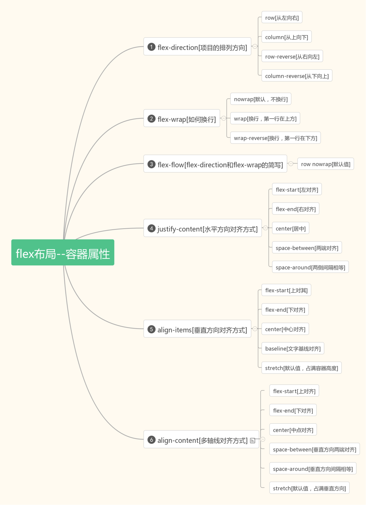
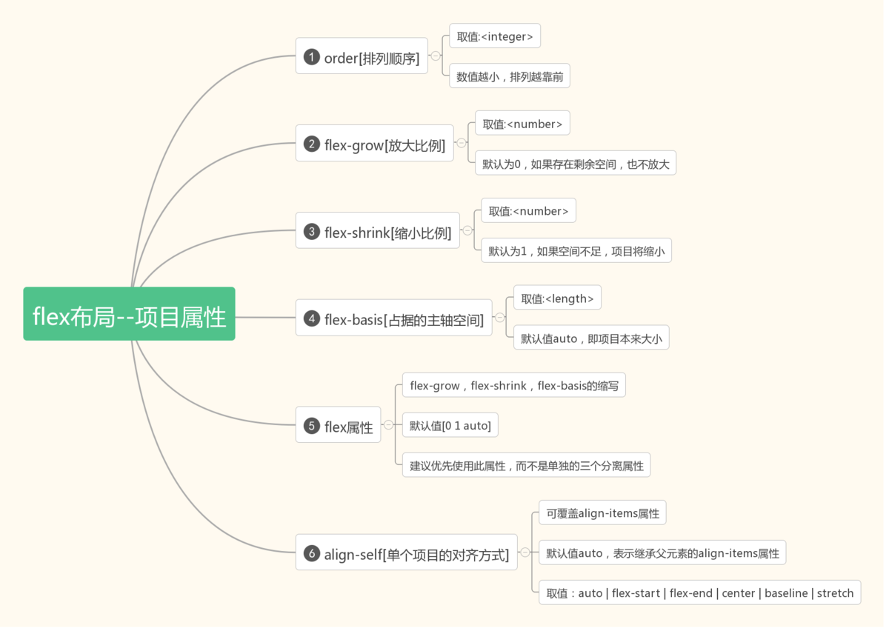

Flex ：布局，基本认知

什么是 Flex 布局？

- flex = flexible = 可伸缩特性 = 弹性能力
- 利用具有自适应伸缩特性的容器实现栏目或组件的弹性布局
- 自适应伸缩特性

1. 布局中的 box 有能力自动判断或改变尺寸适应空间

2. 布局中的 box 能在多个方向进行可控的多种对齐和分布方式

- 一旦激活 flex 机制，则子项的 float、clear和vertical-align属性将失效。

