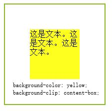
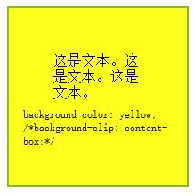
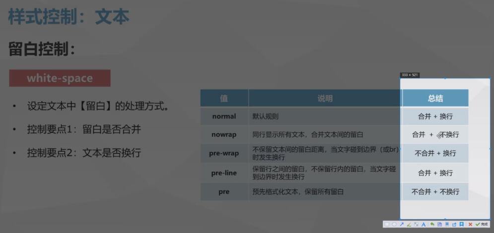
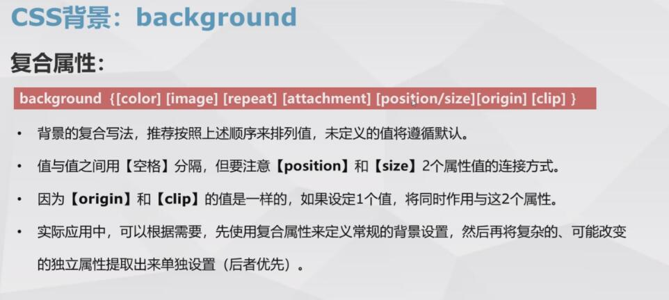

# css-document
css 中一些知识点的记录（css2.0+、css3.0+）

## background 背景属性综述

**背景 Background**

属性 | 版本 | 继承性 | 描述
---|---|---|---
background | CSS1/3 | 无 | 复合属性。设置或检索对象的背景特性
background-color | CSS1 | 无 | 设置或检索对象的背景颜色
background-image | CSS1/3 | 无 | 设置或检索对象的背景图像
background-repart | CSS1/3 | 无 | 设置或检索对象的背景图像如何铺排填充
background-attachment | CSS1/3 | 无 | 设置或检索对象的背景图像时随对象内容滚动还是固定的
background-position | CSS1/3 | 无 | 设置或检索对象的背景图像位置
background-origin | CSS3 | 无 | 设置或检索对象的背景图像显示的原点
background-clip | CSS3 | 无 | 设置或检索对象的背景向外裁剪的区域
background-size | CSS3 | 无 | 设置或检索对象的背景图像的尺寸大小

=======

- background-clip

规定背景的绘制区域：

