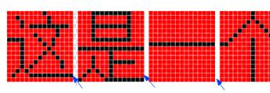

## 文字之间的空白缝隙

场景：

```
<body>
  <nav>
    <a href="">咨询</a>
    <a href="">咨询</a>
    <a href="">咨询</a>
    <a href="">咨询</a>
    <a href="">咨询</a>
    <a href="">咨询</a>
  </nav>
</body>
```

网上找的一张图：



解决办法：

1. 缝隙是由代码的换行操作而引起的
2. 代码换行（回车）-> 带来空白位置 = 空白字符 = 受到文字设定的影响[字号的设定font-ssize]
3. 对inline-block元素的父级对象设定
字号控制 [font-size: 0] === 缝隙消除
4. 对inline-block 元素自身重设字号


```
nav{
  text-align: center;
  font-size: 0; /*父级设置成了 0*/
}
nav a{
  display: inline-block;
  color: white;
  background: black;
  height: 42px;
  line-height: 42px;
  padding 0 20px;
  font-size: 16px; /*重新设置了字号*/
}
```

---


